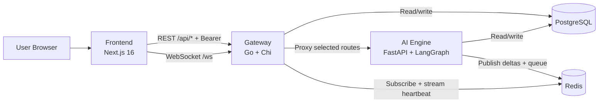
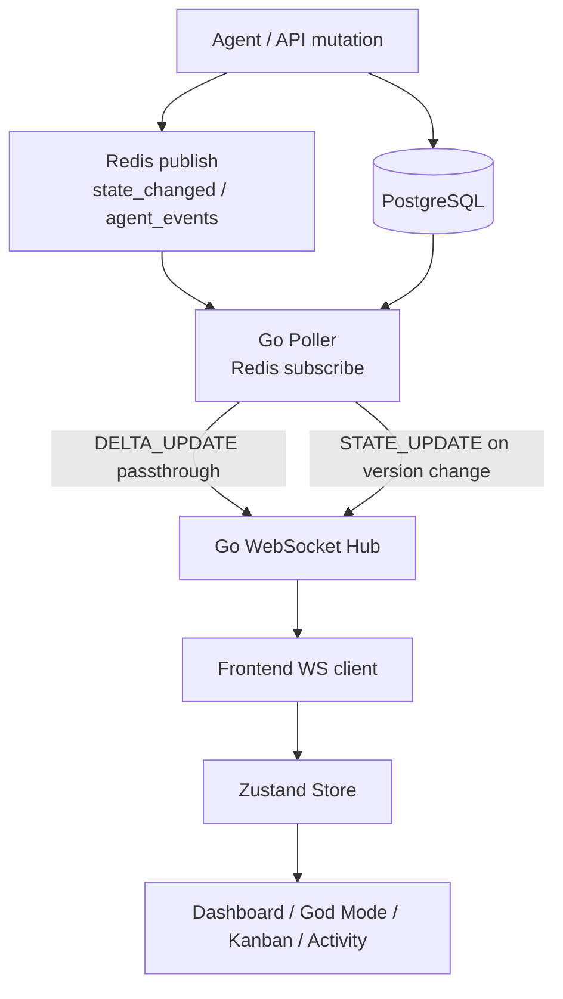

# DevSwarm

A multi-service, real-time "virtual office" where specialized AI agents coordinate work through a shared state model, exposed in a live dashboard.

DevSwarm is a monorepo with:
- A **Next.js frontend** for visualization, control, and chat.
- A **Go gateway/backend** for REST + WebSocket fan-out.
- A **Python AI engine** (FastAPI + LangGraph) for orchestration logic.
- **PostgreSQL** for persistent state and **Redis** for low-latency eventing + queueing.

This README is the user/contributor-facing product and architecture reference. For maintainer/operator implementation rules, see `/Users/matthew/Projects/DevSwarm/CLAUDE.md`.

## Table Of Contents
- [1. Project Goals](#1-project-goals)
- [2. Feature Index](#2-feature-index)
- [3. Architecture](#3-architecture)
- [4. Repository Layout](#4-repository-layout)
- [5. Service Deep Dive](#5-service-deep-dive)
- [6. Agent Catalog](#6-agent-catalog)
- [7. API And Transport Contracts](#7-api-and-transport-contracts)
- [8. Data Model (PostgreSQL)](#8-data-model-postgresql)
- [9. Environment Variables](#9-environment-variables)
- [10. Quick Start (Docker Compose)](#10-quick-start-docker-compose)
- [11. Local Development Runbook](#11-local-development-runbook)
- [12. Command Reference](#12-command-reference)
- [13. Testing](#13-testing)
- [14. CI Pipeline](#14-ci-pipeline)
- [15. Reliability And Runtime Behavior](#15-reliability-and-runtime-behavior)
- [16. Security, Auth, And Hardening Cautions](#16-security-auth-and-hardening-cautions)
- [17. Troubleshooting](#17-troubleshooting)
- [18. Known Limitations](#18-known-limitations)
- [19. License](#19-license)

## 1. Project Goals
DevSwarm is designed to demonstrate and operate a multi-agent workflow loop where:
- A top-level orchestrator decomposes goals into subtasks.
- Specialist agents execute domain work.
- Work state is persisted in PostgreSQL.
- Real-time updates are streamed to clients via WebSocket.
- Operational controls (simulation, global override, trigger) are available from the UI and API.

## 2. Feature Index
### Product/UI features
- Live office floor-plan visualization of agents by room.
- Agent inspector panel with status, task, thought chain, and message context.
- Kanban board for task lifecycle (`Backlog`, `In Progress`, `Review`, `Done`, `Blocked`).
- Activity views:
  - Inter-agent messages.
  - System activity log.
- God Mode panel for:
  - Triggering orchestration goals.
  - Running simulation endpoints.
  - Global state overrides (clock in/out, meeting mode).
  - Cost summary view.
- Chat interface that sends user instructions to the orchestrator flow.

### Platform features
- Redis-backed granular delta updates (`DELTA_UPDATE`) for low-latency UI updates.
- Full-state broadcasts (`STATE_UPDATE`) with versioned payloads.
- Go WebSocket hub for multi-client fan-out.
- AI engine background execution:
  - Redis stream queue worker.
  - Dispatcher that drains assigned pending tasks when agents are idle.
- Cross-service fallback behavior when Redis is unavailable.

## 3. Architecture
### Service topology


### Real-time update path


## 4. Repository Layout
```text
/Users/matthew/Projects/DevSwarm
├── frontend/               # Next.js dashboard and client-side state
├── backend/                # Go API gateway + WebSocket hub
├── ai-engine/              # FastAPI + LangGraph orchestration engine
├── database/init.sql       # PostgreSQL schema + seed data
├── docker-compose.yml      # Full stack local orchestration
├── README.md               # Product/system documentation (this file)
└── CLAUDE.md               # Maintainer/operator handbook
```

## 5. Service Deep Dive
### Frontend (`/Users/matthew/Projects/DevSwarm/frontend`)
- Stack:
  - `next@16.1.6`
  - `react@19.2.3`
  - `zustand@5`
  - `framer-motion@12`
  - Tailwind CSS v4
- Key behavior:
  - `src/lib/api.ts`: REST client with fallback base URL strategy.
  - `src/lib/websocket.ts`: WS client with reconnect/backoff.
  - `src/lib/store.ts`: canonical client state and `STATE_UPDATE`/`DELTA_UPDATE` application.
  - `src/lib/types.ts`: normalization helpers bridge snake_case/camelCase inconsistencies.
- App routes:
  - `/login`
  - `/` (floor plan)
  - `/kanban`
  - `/chat`
  - `/agents`
  - `/activity`
  - `/settings`
- Auth:
  - Simulated login stored in `localStorage` via `AuthProvider`.
  - Demo users:
    - `admin@devswarm.io` / `admin`
    - `viewer@devswarm.io` / `viewer`

### Backend Gateway (`/Users/matthew/Projects/DevSwarm/backend`)
- Stack:
  - Go `1.24`
  - `chi/v5`
  - `gorilla/websocket`
  - `pgx/v5`
  - `redis/go-redis/v9`
- Responsibilities:
  - REST API for agents, tasks, messages, costs, activity, and state.
  - Auth middleware for `/api/*` routes.
  - Reverse proxy for AI-engine routes (`/api/trigger`, `/api/simulate/*`, `/api/mcp/tools`).
  - WebSocket `/ws` endpoint and hub broadcast.
  - Poller:
    - Subscribes Redis channels for low-latency updates.
    - Heartbeat polls DB periodically for eventual consistency.

### AI Engine (`/Users/matthew/Projects/DevSwarm/ai-engine`)
- Stack:
  - Python `3.12`
  - `fastapi`
  - `langgraph`
  - `langchain-google-genai`
  - `asyncpg`
  - `redis.asyncio`
- Responsibilities:
  - Orchestration graph and agent execution lifecycle.
  - Task triggering endpoint (`/api/trigger`) with Redis queue + fallback execution.
  - Per-entity DB operations and delta publication.
  - Redis stream worker (`TaskQueueWorker`) and idle-agent dispatcher.
  - MCP tool registry exposure (`/api/mcp/tools`).
  - Simulation endpoints and optional temporal simulation script.

### Database and Cache
- PostgreSQL tables include:
  - `agents`, `tasks`, `task_assignments`, `messages`, `office_state`, `activity_log`, `agent_costs`.
- Redis channels/stream:
  - `devswarm:state_changed`
  - `devswarm:agent_events`
  - `devswarm:task_queue`

## 6. Agent Catalog
| Agent ID | Display Name | Role | Default Room | Primary Function |
|---|---|---|---|---|
| `orchestrator` | Orchestrator | CEO / Orchestrator | Private Office | Goal decomposition, delegation, routing decisions |
| `crawler` | Crawler | Content Crawler | Desks | Crawl/summarize findings, connectivity checks |
| `researcher` | Researcher | Deep Researcher | War Room | Structured research synthesis |
| `viral_engineer` | Viral Engineer | Viral Engineer | Lounge | Content draft generation |
| `comms` | Comms | Comms Interface | Desks | Message processing and escalation |
| `devops` | DevOps | DevOps Monitor | Server Room | Health checks and recovery flows |
| `archivist` | Archivist | KB Organizer | Desks | Knowledge-base organization |
| `frontend_designer` | Frontend Designer | Frontend Designer | Desks | Design output and critique workflows |

### MCP tool catalog by agent
- `orchestrator`: `create_task`, `assign_agent`, `schedule_meeting`
- `crawler`: `search_web`, `scrape_url`, `summarize_text`
- `researcher`: `academic_search`, `competitor_analysis`, `read_pdf`
- `viral_engineer`: `draft_tweet`, `analyze_sentiment`, `get_trending_topics`
- `comms`: `fetch_emails`, `draft_reply`, `send_newsletter`
- `devops`: `check_uptime`, `view_logs`, `restart_service`
- `archivist`: `update_notion`, `organize_files`, `create_doc`
- `frontend_designer`: `generate_image`, `critique_ui`, `create_mockup`

## 7. API And Transport Contracts
## Auth model (gateway and AI engine)
- Protected routes require:
  - `Authorization: Bearer devswarm-secret-key`
- Exempt routes:
  - Gateway: `/health`, `/api/health`
  - AI engine direct: `/health`, `/docs`, `/openapi.json`

## Gateway REST routes (`http://localhost:8080`)
### Public
- `GET /health`

### Auth-required under `/api`
- Health:
  - `GET /api/health`
- Agents:
  - `GET /api/agents`
  - `GET /api/agents/{id}`
  - `PATCH /api/agents/{id}`
- Tasks:
  - `GET /api/tasks`
  - `POST /api/tasks`
  - `PATCH /api/tasks/{id}/status`
- Messages:
  - `GET /api/messages`
  - `POST /api/messages`
- State:
  - `GET /api/state`
  - `POST /api/state/override`
- Costs:
  - `GET /api/costs`
- Activity:
  - `GET /api/activity`
- Proxied AI routes:
  - `POST /api/trigger`
  - `POST /api/simulate/activity`
  - `POST /api/simulate/demo-day`
  - `GET /api/mcp/tools`

## WebSocket route
- `GET /ws`
- Source of frames:
  - Full state broadcasts.
  - Redis-forwarded delta updates.

### `STATE_UPDATE` payload (example)
```json
{
  "type": "STATE_UPDATE",
  "agents": {
    "orchestrator": {
      "id": "orchestrator",
      "name": "Orchestrator",
      "room": "Private Office",
      "status": "Idle",
      "currentTask": "",
      "thoughtChain": "",
      "techStack": [],
      "avatarColor": "#8b5cf6",
      "updatedAt": "2026-02-20T00:00:00Z"
    }
  },
  "messages": [],
  "tasks": [],
  "version": 42
}
```

### `DELTA_UPDATE` payload (example)
```json
{
  "type": "DELTA_UPDATE",
  "category": "tasks",
  "id": "d6c3...",
  "data": {
    "id": "d6c3...",
    "title": "Research topic",
    "status": "In Progress"
  }
}
```

## AI engine direct routes (`http://localhost:8000`)
- Public:
  - `GET /health`
  - `GET /docs`
  - `GET /openapi.json`
- Auth-required:
  - `GET /api/agents`
  - `GET /api/agents/{agent_id}`
  - `PATCH /api/agents/{agent_id}`
  - `GET /api/tasks`
  - `POST /api/tasks`
  - `PATCH /api/tasks/{task_id}/status`
  - `GET /api/messages`
  - `POST /api/messages`
  - `GET /api/state`
  - `POST /api/state/override`
  - `POST /api/trigger`
  - `GET /api/costs`
  - `GET /api/activity`
  - `GET /api/mcp/tools`
  - `POST /api/simulate/activity`
  - `POST /api/simulate/demo-day`

## Naming and payload shape conventions
- Cross-service payload naming is not perfectly uniform.
- Frontend normalizers are intentionally defensive and accept both forms:
  - snake_case (for example `current_room`, `current_task`)
  - camelCase (for example `room`, `currentTask`)
- Rule of thumb:
  - Treat frontend normalized types in `frontend/src/lib/types.ts` as client contract.

## 8. Data Model (PostgreSQL)
Schema source: `/Users/matthew/Projects/DevSwarm/database/init.sql`

### Enums
- `agent_status`: `Idle`, `Working`, `Meeting`, `Error`, `Clocked Out`
- `task_status`: `Backlog`, `In Progress`, `Review`, `Done`, `Blocked`
- `room_type`: `Private Office`, `War Room`, `Desks`, `Lounge`, `Server Room`

### Core tables
- `agents`: canonical agent presence/state.
- `tasks`: kanban tasks.
- `task_assignments`: many-to-many agent-task assignment.
- `messages`: inter-agent/user communications.
- `office_state`: versioned global state row (id=1).
- `activity_log`: audit/event history.
- `agent_costs`: token/cost tracking.

### Seed behavior
- Seeded agents include all system agents plus `user` (human administrator).
- Initial `office_state` row is created with baseline JSON and version 0.

## 9. Environment Variables
Do not commit real secrets. Keep values in local `.env` only.

| Variable | Used By | Purpose | Typical Local Value |
|---|---|---|---|
| `POSTGRES_USER` | Docker Compose (`db`) | Postgres username | custom local user |
| `POSTGRES_PASSWORD` | Docker Compose (`db`) | Postgres password | custom local password |
| `POSTGRES_DB` | Docker Compose (`db`) | Postgres database name | `devswarm_state` |
| `DATABASE_URL` | AI engine, optionally Go backend | Postgres DSN | `postgresql://...` |
| `DATABASE_URL_GO` | Go backend | Postgres DSN (Go-specific) | `postgres://...?sslmode=disable` |
| `GOOGLE_API_KEY` | AI engine | Gemini model auth | your key |
| `REDIS_URL` | AI engine + Go backend | Redis connection URL | `redis://localhost:6379/0` |
| `AI_ENGINE_URL` | Go backend proxy, simulation script | Upstream AI engine base URL | `http://localhost:8000` or compose DNS |
| `API_AUTH_TOKEN` | `simulate_day.py` | Authorization header value | `Bearer devswarm-secret-key` |
| `NEXT_PUBLIC_API_URL` | Frontend | Browser REST base | `http://localhost:8080/api` |
| `NEXT_PUBLIC_WS_URL` | Frontend | Browser WS URL | `ws://localhost:8080/ws` |
| `PORT` | Go backend | HTTP listen port | `8080` |
| `API_INTERNAL_URL` | Frontend Next.js rewrites | Internal backend origin | `http://localhost:8080` |
| `BACKEND_ORIGIN` | Frontend Next.js rewrites | Alternate backend origin | `http://localhost:8080` |

## 10. Quick Start (Docker Compose)
## Prerequisites
- Docker
- Docker Compose v2
- A valid `GOOGLE_API_KEY` if you need live LLM behavior

## Steps
1. Create `.env` in repo root with required variables (names above).
2. Start the full stack:
```bash
docker compose up -d --build
```
3. Open:
- Frontend: `http://localhost:3000`
- Go gateway health: `http://localhost:8080/health`
- AI engine docs: `http://localhost:8000/docs`

## Shutdown
```bash
docker compose down
```

## Rebuild only changed services
```bash
docker compose build backend ai-engine frontend
docker compose up -d
```

## 11. Local Development Runbook
### Recommended hybrid workflow
Run infra in Docker, run app services locally.

1. Start DB + Redis only:
```bash
docker compose up -d db redis
```

2. Start AI engine (terminal 1):
```bash
cd /Users/matthew/Projects/DevSwarm/ai-engine
python -m pip install -r requirements.txt
uvicorn main:app --reload --host 0.0.0.0 --port 8000
```

3. Start Go backend (terminal 2):
```bash
cd /Users/matthew/Projects/DevSwarm/backend
go run main.go
```

4. Start frontend (terminal 3):
```bash
cd /Users/matthew/Projects/DevSwarm/frontend
npm ci
npm run dev
```

## Minimal smoke checks
```bash
curl http://localhost:8080/health
curl -H 'Authorization: Bearer devswarm-secret-key' http://localhost:8080/api/agents
```

## 12. Command Reference
### Docker / Compose
```bash
# full stack
docker compose up -d --build

# infra only
docker compose up -d db redis

# view logs
docker compose logs -f backend
docker compose logs -f ai-engine
docker compose logs -f frontend

# stop
docker compose down
```

### Frontend commands
```bash
cd /Users/matthew/Projects/DevSwarm/frontend
npm run dev
npm run build
npm run start
npm run lint
npm test
npm run test:watch
```

### Backend commands
```bash
cd /Users/matthew/Projects/DevSwarm/backend
go run main.go
go test ./... -v
go vet ./...
```

### AI engine commands
```bash
cd /Users/matthew/Projects/DevSwarm/ai-engine
python -m pip install -r requirements.txt
uvicorn main:app --reload --port 8000

# lint/type check
ruff check .
mypy .

# tests
pytest tests/ -v
pytest tests/agents/ -v
pytest tests/engine/ -v
pytest tests/system/ -v
pytest tests/contracts/ -v

# probabilistic suite
pytest tests/agents/test_agent_probabilistic.py -v

# simulation script
python simulate_day.py --demo
python simulate_day.py
```

## API trigger examples
```bash
curl -X POST http://localhost:8080/api/trigger \
  -H 'Authorization: Bearer devswarm-secret-key' \
  -H 'Content-Type: application/json' \
  -d '{"goal":"Research emerging multi-agent patterns"}'

curl -X POST http://localhost:8080/api/simulate/demo-day \
  -H 'Authorization: Bearer devswarm-secret-key' \
  -H 'Content-Type: application/json' \
  -d '{}'
```

## 13. Testing
### Frontend
- Frameworks: Vitest + Testing Library + jsdom.
- Scope:
  - `lib` behavior (store, websocket, api, normalization).
  - Component behavior for dashboard primitives.
- Current test files: 14 (`frontend/__tests__/**/*.test.ts(x)`).

Run:
```bash
cd /Users/matthew/Projects/DevSwarm/frontend
npm test
```

### Backend
- Unit tests for API helpers/middleware/hub/cache/models.
- Integration test includes Testcontainers PostgreSQL setup.
- Current test files: 7 (`backend/**/*_test.go`).

Run:
```bash
cd /Users/matthew/Projects/DevSwarm/backend
go test ./... -v
```

### AI engine
- Unit/system tests for agents, engine services, DB helpers, and orchestration flow.
- Includes probabilistic tests (`@probabilistic`) for nondeterministic agent behavior.
- Includes contract tests that validate backend response schemas.
- Current test files: 21 (`ai-engine/tests/test_*.py` and subpackages).

Run:
```bash
cd /Users/matthew/Projects/DevSwarm/ai-engine
pytest tests/ -v
```

## 14. CI Pipeline
Defined at `/Users/matthew/Projects/DevSwarm/.github/workflows/ci.yml`.

Jobs:
- `frontend-test`
  - Node 20
  - `npm ci`, `npm run lint`, `npx tsc --noEmit`, `npm test -- --run`
- `backend-test`
  - Go 1.24
  - `go test ./... -v`, `go vet ./...`
- `ai-engine-test`
  - Python 3.12
  - `pip install -r requirements.txt ruff mypy`
  - `ruff check .`, `mypy .`, `pytest tests/ -v`
- `docker-build`
  - `docker compose build`

## 15. Reliability And Runtime Behavior
### Redis available path (preferred)
- AI engine publishes granular deltas.
- Go poller subscribes Redis and forwards deltas directly.
- Full state broadcasts still occur on version changes/heartbeat.

### Redis unavailable path (degraded but functional)
- Backend startup continues (non-fatal Redis failure).
- AI engine startup continues (non-fatal Redis init failure).
- System relies on periodic DB polling heartbeat for state propagation.
- `/api/trigger` falls back to direct background graph execution if enqueue fails.

### Task execution model
- Orchestrator delegates subtasks and creates task rows.
- Graph execution finalizes the primary delegated task.
- Dispatcher continuously checks idle agents and drains pending assigned tasks.

## 16. Security, Auth, And Hardening Cautions
This repository currently prioritizes development ergonomics over production hardening.

### Non-production defaults present in code
- Static bearer token string for API auth.
- Simulated UI login credentials stored in browser localStorage.
- Broad CORS allowances in gateway defaults.
- Development WebSocket origin check accepts all origins.

### Hardening checklist before production use
- Replace static bearer token with proper authN/authZ (OIDC/JWT/session strategy).
- Remove demo login model from frontend and integrate real identity provider.
- Tighten CORS allowlists to explicit hostnames.
- Restrict WebSocket origin checks.
- Store secrets in a secrets manager, not `.env` committed artifacts.
- Add rate limiting and audit controls at gateway level.

## 17. Troubleshooting
### Frontend shows "Offline" or no agents
1. Verify backend is running:
```bash
curl http://localhost:8080/health
```
2. Verify WebSocket URL (`NEXT_PUBLIC_WS_URL`) points to `/ws` on gateway.
3. Check browser console for WS reconnect loop.

### Trigger endpoint returns 401
- Ensure `Authorization: Bearer devswarm-secret-key` is present.

### No real-time deltas appearing
- Check Redis health and logs.
- If Redis is down, expect slower heartbeat-driven updates instead of instant deltas.

### Backend tests fail on integration setup
- `backend/internal/api/integration_test.go` relies on Testcontainers and Docker availability.

### AI engine contract tests skipped
- `ai-engine/tests/contracts/test_backend_contract.py` skips when backend is not reachable.

### Simulation script cannot call API
- Ensure `AI_ENGINE_URL` and `API_AUTH_TOKEN` are set for the script runtime.

## 18. Known Limitations
- Auth and user model are demo-grade.
- Payload naming consistency is mixed across services, requiring normalization.
- Some MCP tools are placeholder/simulated behavior and not external system-integrated.
- Gateway and AI engine both expose overlapping API surfaces; gateway is intended browser entrypoint.
- Temporal simulation script is optional and not orchestrated by compose as a separate service by default.

## 19. License
MIT License.
